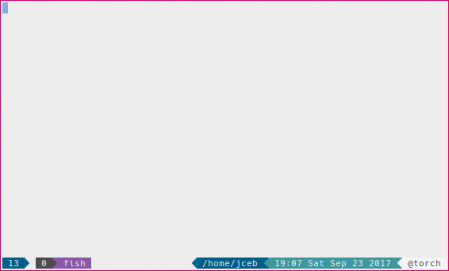

# blinds.nvim emphasizes the current window

blinds.nvim emphasizes the current window by shading the non-active windows.



## Installation

Lazy:

```lua
{
  -- https://github.com/jceb/blinds.nvim
  "jceb/blinds.nvim",
  config = true,
}
```

## Default configuration

```lua
{
  -- background color
  guibg = "#969694",
  -- Limit blinds to certain file types, "*" matches all file types.
  ft = { "*" },
  -- Exclude certain file types from blinds.
  excluded = { "aerial" },
}
```

# Requirements

neovim version 0.2 and above that supports the
[`winhighlight`](https://neovim.io/doc/user/options.html#%27winhighlight%27)
feature.
